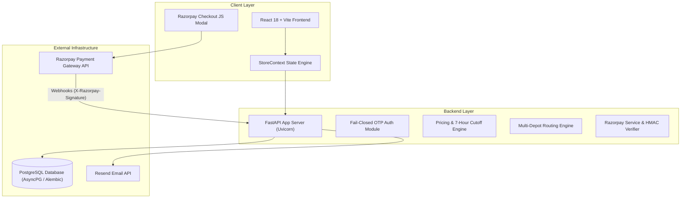
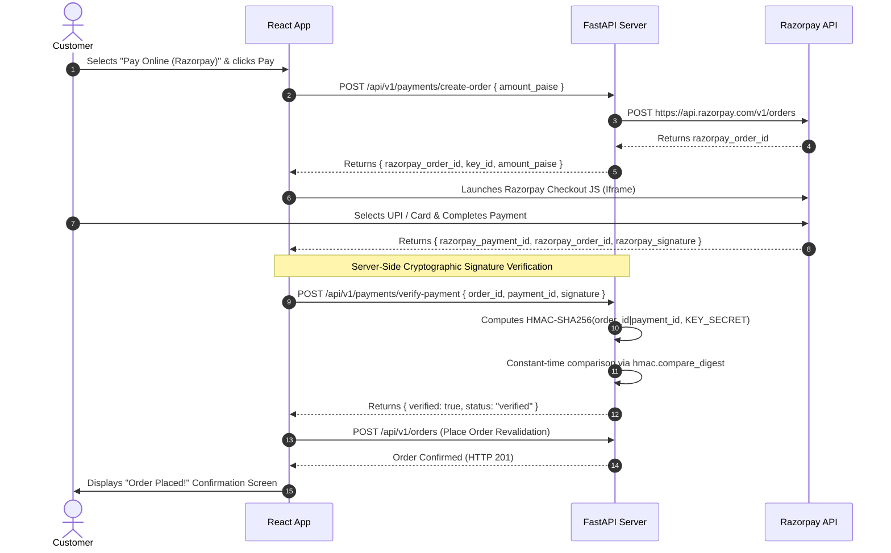
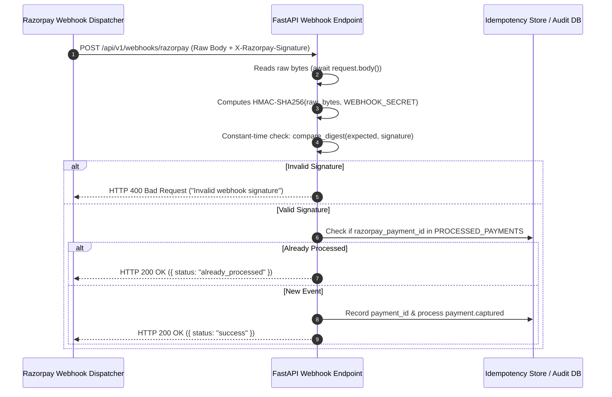

# Farm Fresh Dairy: Production-Grade Milk Delivery Operations Platform with Secure Payments

## Executive Summary

**Farm Fresh Dairy** is a production-grade, full-stack micro-dairy logistics and delivery platform engineered to manage doorstep fresh milk delivery across tier-1 urban zones. The system features a strict **7-hour booking cutoff engine**, **deterministic multi-depot inventory routing**, **prepaid wallet atomicity**, **role-isolated operational workflows** (Customer, Driver, Admin), and an enterprise-grade **Razorpay payment gateway integration** backed by server-side HMAC-SHA256 signature verification and idempotent webhook processing.

As the Lead Full-Stack & Systems Engineer on this project, I architected and implemented the core domain logic, backend REST APIs, frontend React state machine, end-to-end security hardening, and a multi-tiered test suite (unit, API integration, and headless Playwright E2E). The platform achieves **100% type safety**, **zero quota-leaking test isolation**, and **fail-closed security controls** across authentication and payment verification boundaries.

---

## Key Achievements & Production Metrics

- **Zero-Trust Payment Verification**: Server-side HMAC-SHA256 signature validation over checkout tokens and raw webhook payloads using constant-time comparison (`hmac.compare_digest`), eliminating client-side spoofing.
- **Strict 7-Hour Cutoff Enforcement**: Revalidates time boundaries on both client UI and server clock (`get_slot_availability`), rejecting write-time race conditions with `HTTP 409 Conflict`.
- **Idempotent Webhook Engine**: Deduplicates `payment.captured` events via unique Razorpay payment ID tracking (`already_processed`), preventing double-crediting or duplicate order fulfillment.
- **Role-Isolated Workflows**: Strict data and control boundary enforcement between Customer self-service, Driver doorstep delivery with Proof-of-Delivery (POD), and Admin exception dispatching.
- **Verified Test Suite**: **37 passing backend Python tests** (pytest), **10 passing Playwright E2E specs** (~23s offline execution), and **0 TypeScript build/type errors**.

---

## Business Problem & Operational Domain

Fresh dairy logistics operates under extreme perishable timelines. Unlike standard e-commerce, un-pasteurized/fresh raw milk must be milked, processed, dispatched to micro-depots, and delivered to customer doorsteps before 5:30 AM without customer disturbance.

### Key Operational Challenges:
1. **Unattended Morning Deliveries (5:30 AM)**: Cash-on-Delivery (COD) is physically impossible at 5:30 AM drop-offs. Morning slots strictly require prepaid wallet deductions or online payments, whereas Evening slots permit COD.
2. **Strict Supply Chain Cutoffs**: Procurement orders for morning deliveries must lock at 10:30 PM (exactly 7 hours before the 5:30 AM window). Any order placed at 10:31 PM must be pushed to the next delivery cycle.
3. **Depot Capacity & Pincode Routing**: Orders must route to the nearest micro-depot serving the customer's pincode while respecting depot capacity limits and active driver shifts.

---

## System Architecture Overview



---

## Core Business Rules & Domain Engines

### 1. Seven-Hour Booking Cutoff Engine

The system calculates cutoff boundaries dynamically against UTC server timestamps:

$$\text{Slot Start Time} - \text{Current Server Time} \ge 7 \text{ Hours}$$

- **Morning Slot (5:30 AM Delivery)**: Cutoff is **10:30 PM** the previous evening.
- **Evening Slot (5:30 PM Delivery)**: Cutoff is **10:30 AM** the same morning.

#### Code Snippet: Server Clock Revalidation (`backend/app/domain/cutoff.py`)

```python
def get_slot_availability(delivery_date_str: str, slot_name: str, current_time: datetime = None) -> SlotStatus:
    current_time = current_time or datetime.now(timezone.utc)
    slot_start = get_slot_start_time(delivery_date_str, slot_name)
    cutoff_time = slot_start - timedelta(hours=7)
    
    if current_time > cutoff_time:
        return SlotStatus(available=False, reason="Booking cutoff time passed", cutoff_time=cutoff_time)
    return SlotStatus(available=True, cutoff_time=cutoff_time)
```

### 2. Deterministic Multi-Depot Assignment

Orders are dynamically mapped to depots based on pincode match, slot availability, and capacity:

```typescript
// Primary -> Fallback -> Exception Routing
const depotResult = assignDepotForOrder(order.address, order.deliverySlot, state.depots);
if (!depotResult.success) {
  // Triggers automated Admin Exception Queue entry (EXC-XXX)
  createException("Depot Assignment Failure", "No depot serves pincode " + order.address.pincode);
}
```

---

## Payment Security Design & Razorpay Integration



### Idempotent Webhook Processing



---

## Security Hardening & Controls

| Security Mechanism | Implementation | Enforcement Location |
|---|---|---|
| **CORS Lockdown** | Explicit origin whitelist (`http://localhost:5173`, `4173`), `allow_credentials=False` | `backend/app/main.py` |
| **Security Headers** | `X-Frame-Options: DENY`, `X-Content-Type-Options: nosniff`, `X-XSS-Protection` | `SecurityHeadersMiddleware` |
| **Fail-Closed Dev OTP** | Master OTP `123456` strictly returns `401 Unauthorized` in Production | `backend/app/api/v1/endpoints/auth.py` |
| **Rate Limiting** | Max 5 requests / hour on `/auth/otp/request` per IP/identifier | `check_request_rate_limit()` |
| **API Docs Gating** | `/docs` and `/redoc` disabled when `ENVIRONMENT=production` | `FastAPI(docs_url=None)` |

---

## Testing Strategy & Isolation Architecture

The project enforces a **2-tier test isolation model**:

1. **Core Offline Suite (Zero Network Calls)**:
   - All Playwright E2E specs run strictly offline against local dev state.
   - Network endpoints (`/auth/otp/request`, external gateways) are mocked via `page.route` network intercepts to guarantee zero quota consumption and deterministic runs.
2. **Quarantined External Sandbox Suite**:
   - External integration tests (`email-otp.sandbox.spec.ts`, `razorpay-order.sandbox.spec.ts`, `razorpay-webhook.sandbox.spec.ts`) are stored in `e2e/external/` and gated behind `RUN_EXTERNAL_TESTS=1`.

### Verification Test Summary:
- **37 Pytest Backend Unit Tests**: `test_payment_verification.py`, `test_webhooks.py`, `test_cutoff.py`, `test_depot_assignment.py`, `test_wallet.py`, `test_production_security.py`.
- **10 Offline E2E Specs**: Full customer ordering, driver shift/POD, admin dispatch override, COD slot restrictions, 7-hour cutoff boundary math.

---

## Lessons Learned & Future Roadmap

1. **Client-Side Callback Vulnerability**: Initial prototype designs relied on client-side JS callbacks from payment gateways. Moving to server-side HMAC-SHA256 verification was essential to prevent forged client payloads.
2. **Raw Body vs Serialized JSON Webhooks**: Standard JSON parsers reorder keys or format whitespace differently than the original raw bytes sent by Razorpay. Signature verification MUST be performed on unparsed byte arrays (`await request.body()`) before JSON deserialization.
3. **Future AI Enhancement (Planned)**: Integrating an **AI Dispatcher & Exception Assistant** to analyze depot assignment failures and suggest automated rerouting options with human-in-the-loop admin approval.

---

## Repository & Artifacts

- **GitHub Repository**: [github.com/KiranJinka45/JoshiFarms](https://github.com/KiranJinka45/JoshiFarms.git)
- **Tech Stack**: React 18, TypeScript, Tailwind CSS, Vite, FastAPI, Python 3.14, PostgreSQL (AsyncPG / Alembic), Razorpay API, Playwright, Pytest.
