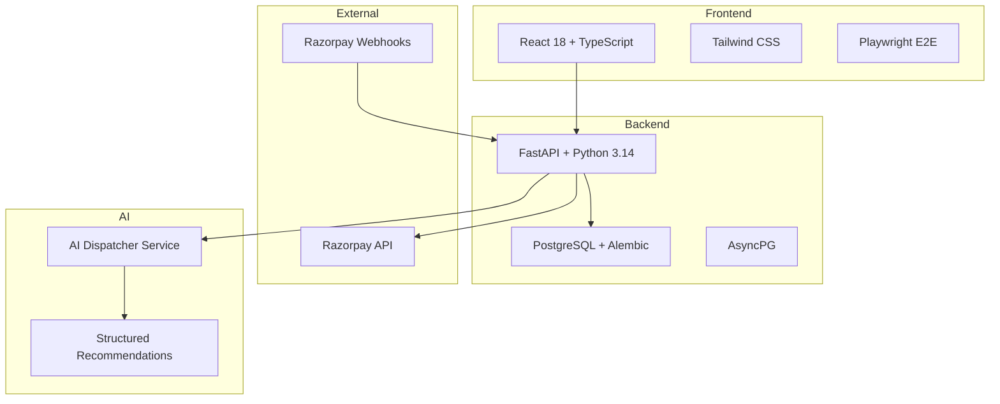
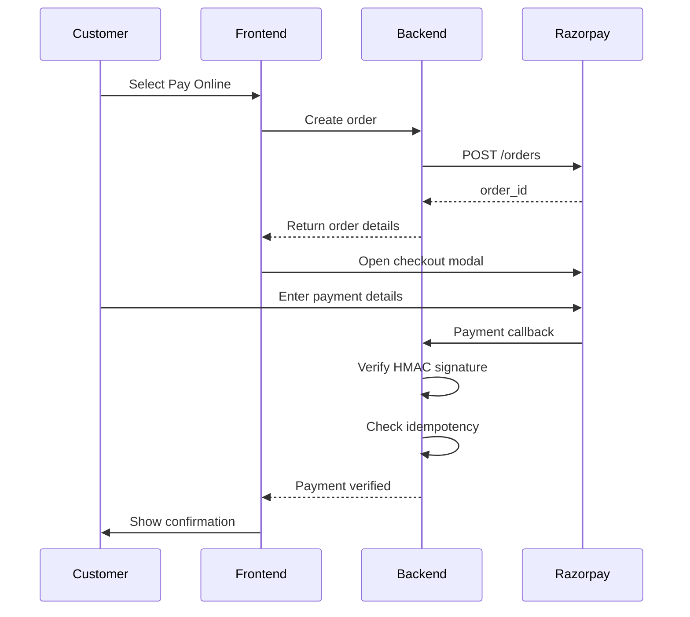
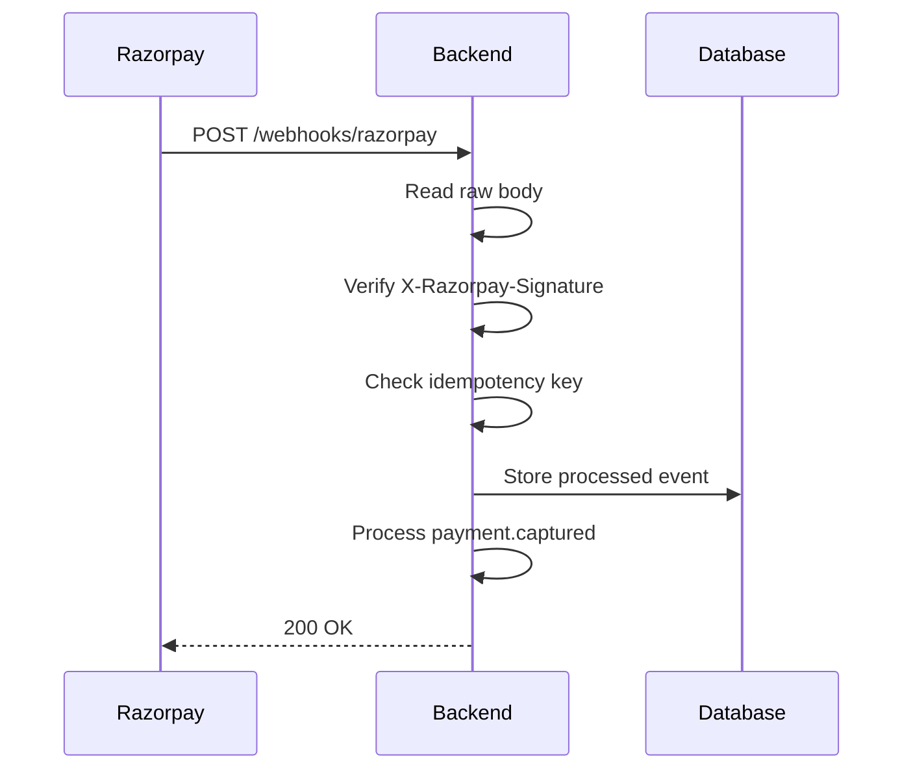

# Farm Fresh Dairy — Production-Grade Milk Delivery Platform

A full-stack, AI-assisted micro-dairy logistics platform with secure payments, multi-depot routing, seven-hour cutoff enforcement, and human-in-the-loop exception handling.

[Case Study](CASE_STUDY.md) · [GitHub Repository](https://github.com/KiranJinka45/JoshiFarms)

---

## Executive Summary

**Farm Fresh Dairy** is a production-grade micro-dairy logistics platform that manages fresh milk delivery across urban zones with strict perishable timelines. The system enforces a 7-hour booking cutoff, routes orders through multiple depots based on capacity and service zones, processes payments via Razorpay with server-side HMAC-SHA256 verification, and uses an **AI Dispatcher Assistant** to resolve operational exceptions with human approval.

Built as a showcase for **Forward-Deployed AI Engineering** capabilities, this project demonstrates end-to-end system design, payment security, AI integration, and rigorous testing discipline.

---

## Key Capabilities

### 🛡️ Payment Security
- **Server-side HMAC-SHA256 verification** for checkout responses and webhooks
- **Constant-time comparison** using `hmac.compare_digest`
- **Idempotent webhook processing** preventing double-crediting (`already_processed`)
- **Fail-closed controls** rejecting tampered or missing signatures

### ⏱️ Business Logic Engine
- **7-hour cutoff enforcement** with client and server clock revalidation
- **Multi-depot routing** based on pincode, capacity, and slot availability
- **Role-isolated workflows** for Customer, Driver, and Admin
- **Prepaid wallet atomicity** for 5:30 AM unattended deliveries

### 🤖 AI-Assisted Operations
- **Structured AI recommendations** with 90%+ confidence scores (`POST /api/v1/admin/ai/suggest-exception-resolution`)
- **Human-in-the-loop approval** for all AI-suggested actions
- **Exception resolution** for unassigned orders and failed deliveries
- **Audit logging** for all AI interactions and decisions

### ✅ Verified Quality
- **39 passing backend tests** (`pytest`)
- **10 passing E2E specs** (`Playwright`, offline isolation)
- **0 TypeScript errors** (strict mode)
- **Clean production build** (`Vite`)

---

## System Architecture



---

## Security Design

### Payment Verification Flow



### Webhook Processing & Idempotency



---

## Core Business Rules

### 7-Hour Cutoff Formula

```python
def is_slot_available(delivery_date: str, slot: str, current_time: datetime) -> bool:
    slot_start = get_slot_start_time(delivery_date, slot)
    cutoff_time = slot_start - timedelta(hours=7)
    return current_time <= cutoff_time
```

- **Morning Slot (5:30 AM)**: Cutoff at 10:30 PM previous evening
- **Evening Slot (5:30 PM)**: Cutoff at 10:30 AM same morning

---

## AI Dispatcher Assistant

### Endpoint
`POST /api/v1/admin/ai/suggest-exception-resolution`

```json
{
  "exception_id": "EXC-1001",
  "order_id": "ORD-9999",
  "summary": "Order failed primary depot assignment for pincode 560099",
  "suggested_action": "Override routing to Primary Regional Hub",
  "recommended_depot_id": "depot-1",
  "recommended_depot_name": "Koramangala Central Depot",
  "confidence_score": 0.94,
  "reasoning": "Closest operational fallback with available morning capacity (120/500)",
  "requires_human_approval": true
}
```

---

## Testing Strategy

| Suite | Network Calls | Purpose |
|---|---|---|
| **Core Offline** | ❌ None | Deterministic, zero quota leakage |
| **External Sandbox** | ✅ Live APIs | Quarantined behind `RUN_EXTERNAL_TESTS=1` |

- **Backend**: 39 tests (`payment`, `webhooks`, `cutoff`, `depot_assignment`, `ai_dispatcher`)
- **E2E**: 10 specs (`customer journey`, `driver workflow`, `admin dispatch`)
- **Type Safety**: 0 TypeScript errors (strict mode)

---

## Tech Stack

- **Frontend**: React 18, TypeScript, Tailwind CSS, Vite
- **Backend**: FastAPI, Python 3.14, AsyncPG, Alembic
- **Database**: PostgreSQL
- **Payment**: Razorpay API + Webhooks
- **Testing**: Pytest, Playwright
- **AI**: Structured LLM reasoning with Human-in-the-Loop approval

---

## License

MIT License — see [LICENSE](LICENSE) for details.
