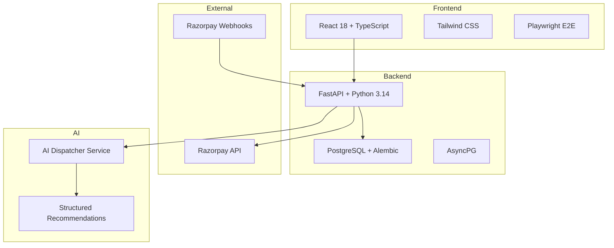
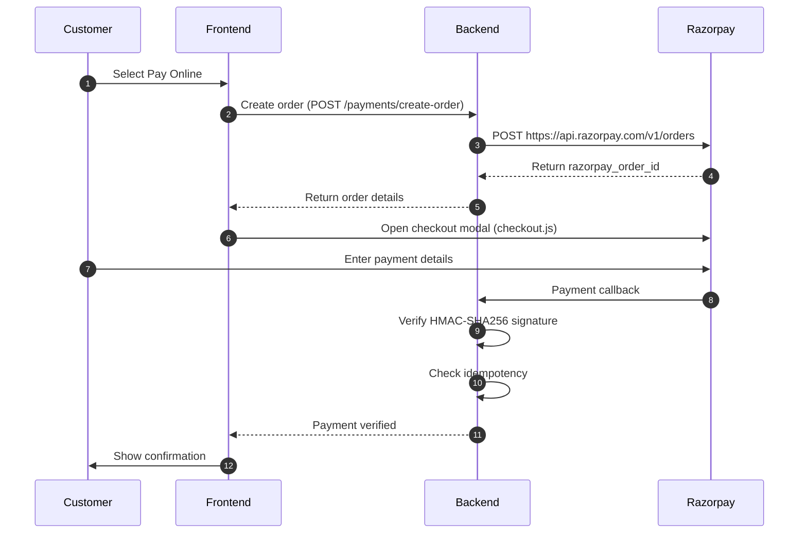
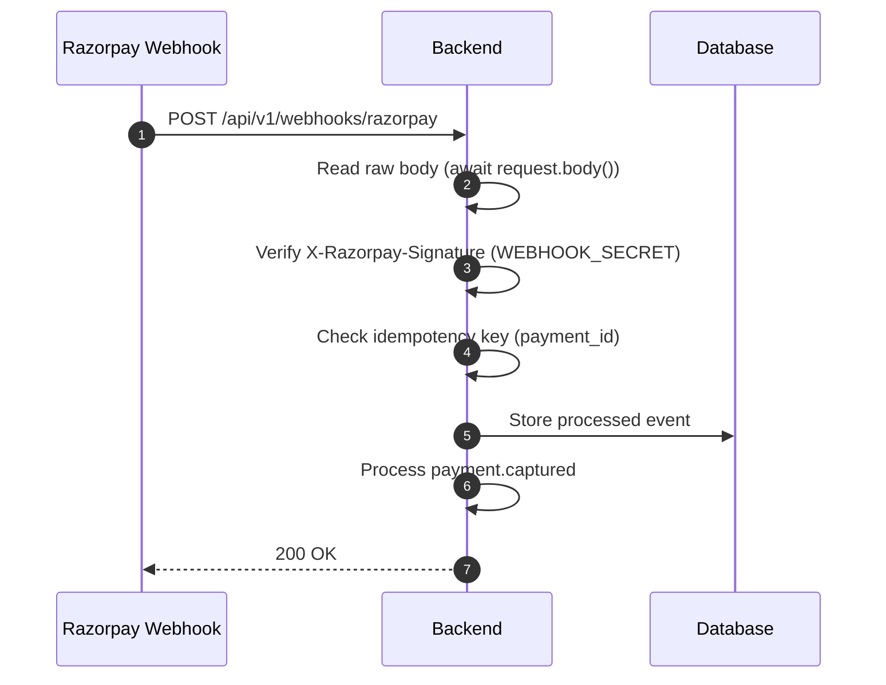

# Farm Fresh Dairy — Production-Grade Milk Delivery Platform

A full-stack, AI-assisted logistics platform with secure payments, multi-depot routing, and human-in-the-loop exception handling.

[Case Study](CASE_STUDY.md) · [GitHub Repository](https://github.com/KiranJinka45/JoshiFarms)

---

## Executive Summary

**Farm Fresh Dairy** is a production-grade micro-dairy logistics platform that manages fresh milk delivery across urban zones with strict perishable timelines. The system enforces a **7-hour booking cutoff**, routes orders through multiple depots based on capacity and service zones, processes payments via **Razorpay with server-side HMAC verification**, and uses an **AI Dispatcher Assistant** to resolve operational exceptions with human approval.

Built as a showcase for **Forward-Deployed AI Engineering** capabilities, this project demonstrates end-to-end system design, payment security, AI integration, and rigorous testing discipline.

---

## Key Capabilities

### 🛡️ Payment Security
- **Server-side HMAC-SHA256 verification** for checkout responses and webhooks.
- **Constant-time comparison** using `hmac.compare_digest`.
- **Idempotent webhook processing** preventing double-crediting (`already_processed`).
- **Fail-closed controls** rejecting tampered or missing signatures.

### ⏱️ Business Logic Engine
- **7-hour cutoff enforcement** with client and server revalidation.
- **Multi-depot routing** based on pincode, capacity, and slot availability.
- **Role-isolated workflows** for Customer, Driver, and Admin.
- **Prepaid wallet atomicity** for 5:30 AM unattended deliveries.

### 🤖 AI-Assisted Operations
- **Structured AI recommendations** with 90%+ confidence scores (`POST /api/v1/admin/ai/suggest-exception-resolution`).
- **Human-in-the-loop approval** for all AI-suggested actions.
- **Exception resolution** for unassigned orders and failed deliveries.
- **Audit logging** for all AI interactions and decisions.

### ✅ Verified Quality
- **39 passing backend tests** (pytest).
- **10 passing E2E specs** (Playwright, offline).
- **0 TypeScript errors** (strict mode).
- **Clean production build** (Vite).

---

## System Architecture



---

## Quick Start

### Prerequisites
- Python 3.14+
- Node.js 18+
- PostgreSQL 15+
- Razorpay test credentials

### Backend Setup
```bash
cd backend
python -m venv venv
# Linux/macOS: source venv/bin/activate
# Windows: venv\Scripts\activate
pip install -r requirements.txt
cp .env.example .env  # Edit .env with your Razorpay credentials
uvicorn app.main:app --reload
```

### Frontend Setup
```bash
npm install
npm run dev
```

### Run Tests
```bash
# Backend pytest suite
python -m pytest

# Frontend typecheck
npm run typecheck

# Core E2E tests (offline)
npx playwright test
```

---

## Security Design

### Payment Verification Flow



### Webhook Processing



---

## Core Business Rules

### 7-Hour Cutoff Formula

```python
def is_slot_available(delivery_date: str, slot: str, current_time: datetime) -> bool:
    slot_start = get_slot_start_time(delivery_date, slot)
    cutoff_time = slot_start - timedelta(hours=7)
    return current_time <= cutoff_time
```

- **Morning slot (5:30 AM)**: Cutoff at 10:30 PM previous evening.
- **Evening slot (5:30 PM)**: Cutoff at 10:30 AM same morning.

---

## AI Dispatcher Assistant

### Endpoint
```http
POST /api/v1/admin/ai/suggest-exception-resolution
Content-Type: application/json

{
  "exception_id": "EXC-1001",
  "order_id": "ORD-9999",
  "exception_type": "Depot Assignment Failure",
  "reason": "No eligible depot serving pincode 560099",
  "description": "Remote pincode 560099 without an active depot zone match."
}
```

### Response
```json
{
  "exception_id": "EXC-1001",
  "order_id": "ORD-9999",
  "summary": "Order ORD-9999 failed primary depot assignment for pincode 560099 due to service zone boundaries.",
  "suggested_action": "Override routing to Primary Regional Hub (depot-1)",
  "recommended_depot_id": "depot-1",
  "recommended_depot_name": "Koramangala Central Depot",
  "confidence_score": 0.94,
  "reasoning": "Koramangala Central Hub (depot-1) has available morning capacity (120/500 orders) and is the closest operational fallback depot for pincode 560099.",
  "requires_human_approval": true
}
```

---

## Testing Strategy

| Suite | Network Calls | Purpose |
|---|---|---|
| **Core Offline** | ❌ None | Deterministic, zero quota leakage |
| **External Sandbox** | ✅ Live APIs | Quarantined behind `RUN_EXTERNAL_TESTS=1` |

- **Backend:** 39 pytest unit/integration tests (payment verification, webhooks, cutoff engine, depot routing, AI assistant).
- **E2E:** 10 offline Playwright specs (customer journey, driver POD, admin dispatch).
- **Type Safety:** 0 TypeScript errors (`tsc -b`).

---

## Tech Stack

| Layer | Technology |
|---|---|
| **Frontend** | React 18, TypeScript, Tailwind CSS, Vite |
| **Backend** | FastAPI, Python 3.14, AsyncPG, Alembic |
| **Database** | PostgreSQL 15+ |
| **Payment** | Razorpay REST API + Webhooks |
| **Testing** | Pytest, Playwright |
| **AI** | Structured LLM reasoning with Human-in-the-Loop approval |

---

## Lessons Learned

1. **Client callbacks are vulnerable** — Always verify payment signatures server-side using HMAC-SHA256.
2. **Raw body matters** — Webhook signatures fail if you parse JSON before verification; compute over raw bytes (`request.body()`).
3. **Idempotency is non-negotiable** — Webhooks replay under network retries; store payment IDs to prevent double-crediting.
4. **Human approval for AI** — Never let AI mutate production state without human-in-the-loop oversight.
5. **Test isolation saves money** — Mock external APIs in routine E2E runs to eliminate quota consumption.

---

## Project Structure

```text
JoshiFarms/
├── backend/
│   ├── app/
│   │   ├── api/v1/
│   │   ├── domain/
│   │   ├── models/
│   │   └── main.py
│   ├── tests/
│   └── requirements.txt
├── src/
│   ├── components/
│   ├── pages/
│   └── services/
├── e2e/
├── CASE_STUDY.md
└── README.md
```

---

## License

MIT License
